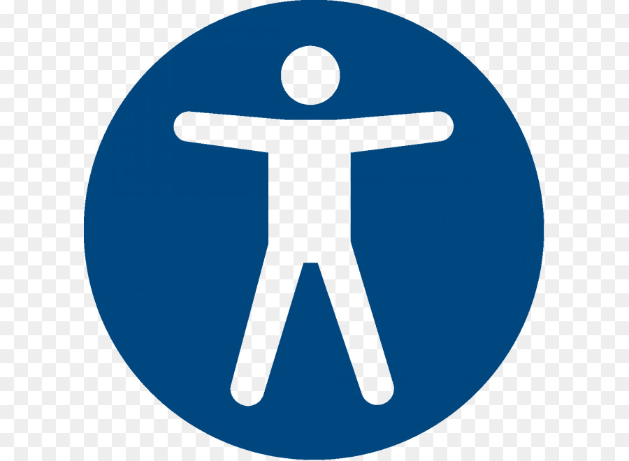
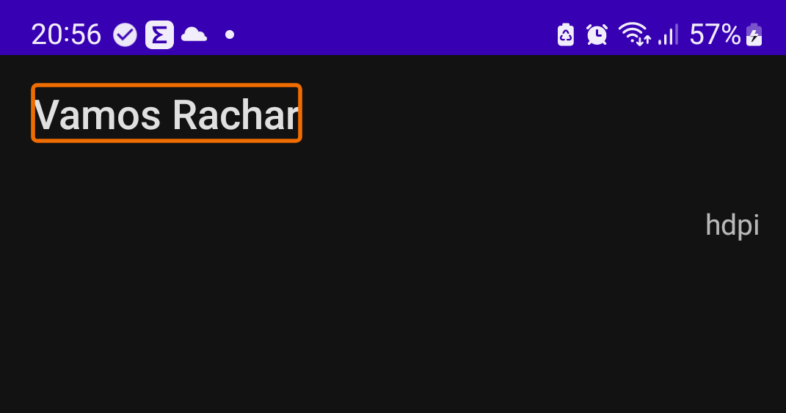
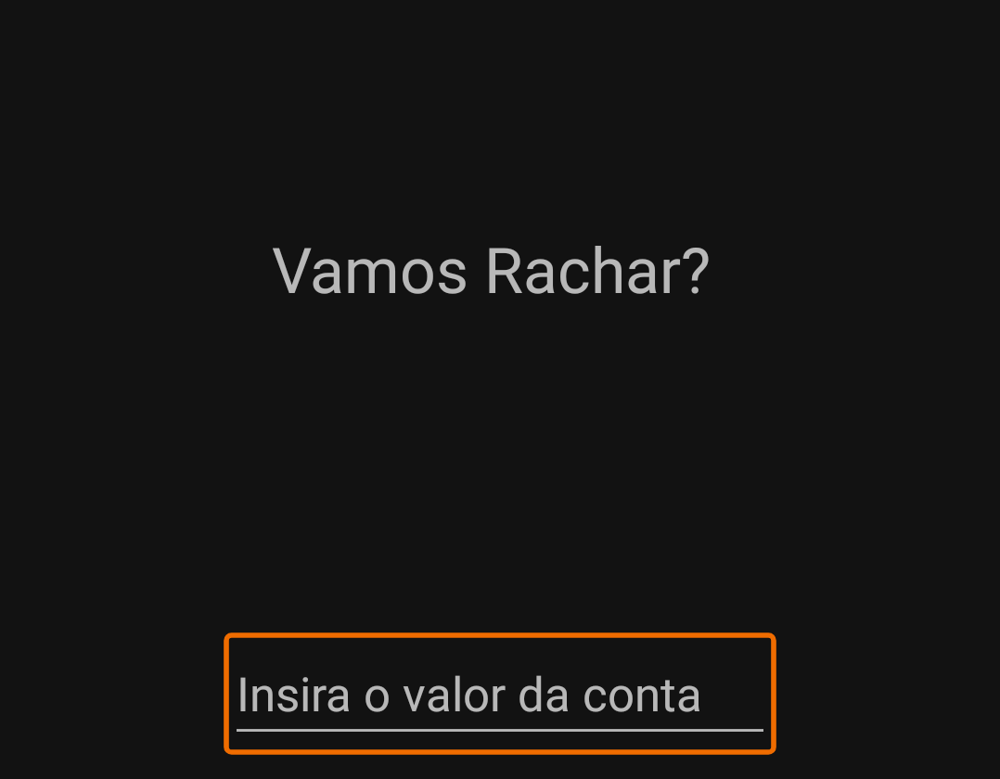
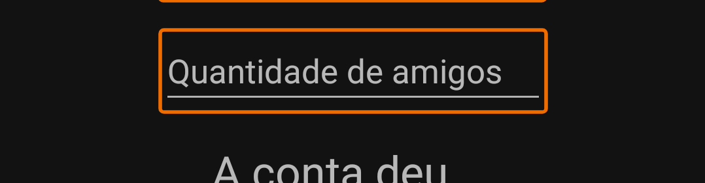
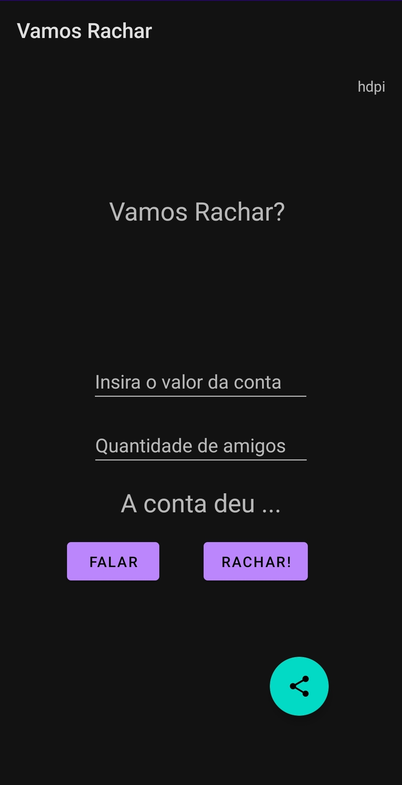
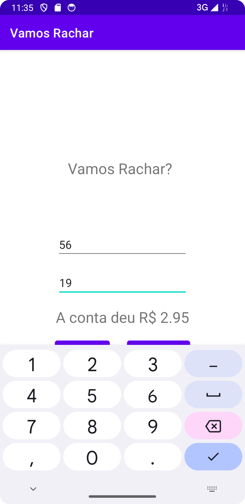

## AT 04 Apps acessíveis

### Erros apontados pelo Accessibility Scanner

A lista a seguir contém oportunidades de melhoria na acessibilidade de Vamos Rachar.  
Cada item corresponde a uma área delineada na captura de tela anexa.  
 
Tamanho do texto
[45,116][409,192]
Especifique o texto em escala de pixels (sp).  
   
   
Área de toque
com.example.constraintlayout:id/editConta
A altura deste item é 45dp. Considere definir a altura desta área de toque como 48dp ou maior.  
   
   
Área de toque
com.example.constraintlayout:id/editNumberAmigos
A altura deste item é 45dp. Considere definir a altura desta área de toque como 48dp ou maior.  

### Repositório dos novos códigos  
Commit com correção para os tamanhos mínimos sugeridos
https://github.com/pvictorc/VamosRachar/commit/6ea1840e0599006d04ba446b05461d42dd081940

#### Novas telas 
   

#### Modificações de descrição realizadas para reduzir os problemas de acessibilidade
As descrições já estavam aplicadas.

### Comparação Versões iniciais X novo relatório do Accessibility Scanner  
Antes  
  

Depois  
  